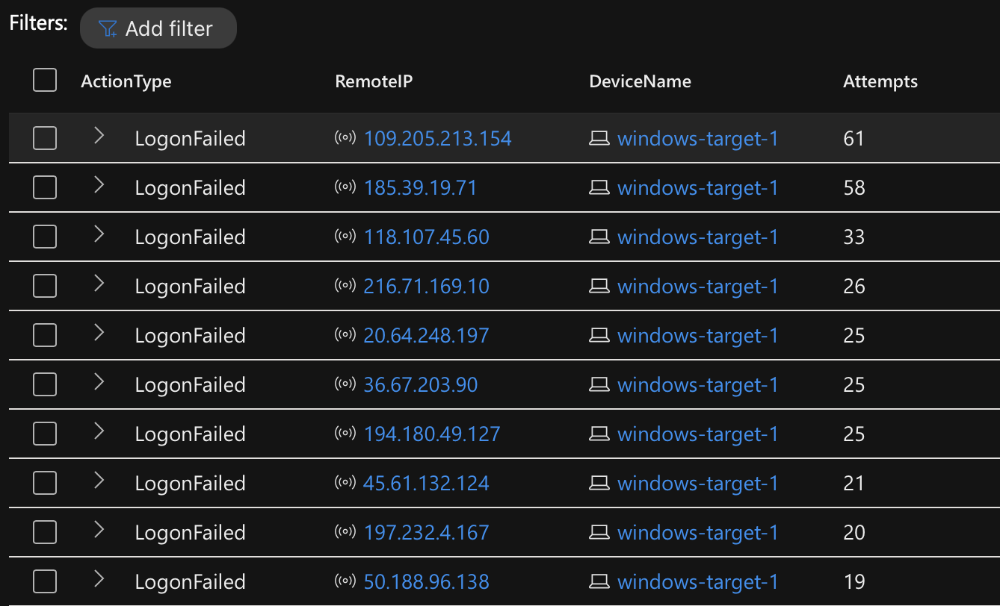

# 🛡️ Threat Hunting Report: Internet-Exposed VM in Shared Services Cluster

**Author**: Jason Nguyen  
**Date**: 11 June 2025

**Tools & Technologies Used**:
- Microsoft Azure 
- Microsoft Defender for Endpoint (MDE)
- Microsoft Sentinel
- Azure Log Analytics
- KQL (Kusto Query Language)
- GitHub (Markdown, Repo Management)

## 📌 Scenario

During routine maintenance, the security team was tasked with investigating any virtual machines (VMs) in the **shared services cluster** (handling DNS, DHCP, Domain Services, etc.) that may have been mistakenly exposed to the public internet. These VMs could be subject to **external brute-force login attempts**, potentially leading to **lateral movement** within the network.

> **Hypothesis**: Misconfigured VMs might be internet-facing and exposed to brute-force login attempts. Some may lack account lockout policies, allowing repeated logon attempts and possible unauthorized access.

---

## 🖥️ Virtual Machine Selection

- **VM chosen**: `windows-target-1`
- **Rationale**: This honeypot VM is always-on and more exposed than the user-onboarded MDE VM, providing richer data for analysis.

---

## 1️⃣ Preparation

- **Lateral Movement**: Movement by an attacker from one system/account to another to escalate privileges or deploy malware (e.g. ransomware).
- **Attack Surface**: VMs exposed to the internet without proper restrictions may allow attackers to brute-force credentials.

---

## 2️⃣ Data Collection

**Check which devices were internet-facing:**

```kql
DeviceInfo
| where DeviceName == "windows-target-1"
| where IsInternetFacing == true
| order by Timestamp desc
```

> ✅ `windows-target-1` was internet-facing, with latest exposure at `2025-06-10T13:22:47.6039291Z`.

---

## 3️⃣ Investigation of Failed Logins

**KQL to find failed remote login attempts:**

```kql
DeviceLogonEvents
| where DeviceName == "windows-target-1"
| where LogonType has_any("Network", "Interactive", "RemoteInteractive", "Unlock")
| where ActionType == "LogonFailed"
| where isnotempty(RemoteIP)
| summarize Attempts = count() by RemoteIP
| order by Attempts desc
```

> 🔎 Multiple IPs (bad actors) repeatedly attempted to access the VM.



---

## 4️⃣ Investigation of Top Suspicious IPs

**Check if any of the top 10 IPs had successful logins:**

```kql
let RemoteIPsInQuestion = dynamic(["109.205.213.154", "185.39.19.71", "118.107.45.60", "216.71.169.10", "20.64.248.197", "36.67.203.90", "194.180.49.127", "45.61.132.124", "197.232.4.167", "50.188.96.138"]);
DeviceLogonEvents
| where LogonType has_any("Network", "Interactive", "RemoteInteractive", "Unlock")
| where ActionType == "LogonSuccess"
| where RemoteIP has_any(RemoteIPsInQuestion)
```

> ✅ **Result**: **No successful logins** from the top 10 suspicious IPs.

---

## 5️⃣ Who Successfully Logged In?

**Check successful logins on `windows-target-1`:**

```kql
DeviceLogonEvents
| where DeviceName == "windows-target-1"
| where LogonType == "Network"
| where ActionType == "LogonSuccess"
| where AccountName == "labuser"
| summarize count()
```

> ✅ Only the account `labuser` had successful logins (2 in total).

---

## 6️⃣ Was `labuser` Brute-Forced?

```kql
DeviceLogonEvents
| where DeviceName == "windows-target-1"
| where LogonType == "Network"
| where ActionType == "LogonFailed"
| where AccountName == "labuser"
| summarize count()
```

> ✅ **Result**: Zero (0) failed logins for `labuser`. No evidence of brute-force attempts.

---

## 7️⃣ Where Did `labuser` Log In From?

```kql
DeviceLogonEvents
| where DeviceName == "windows-target-1"
| where LogonType == "Network"
| where ActionType == "LogonSuccess"
| where AccountName == "labuser"
| summarize LoginCount = count() by DeviceName, ActionType, AccountName, RemoteIP
```


> 📍 Successful login originated from **Saitama, Japan**. This is assumed to be legitimate (e.g. lab user).

---

## ✅ Conclusion

- `windows-target-1` was confirmed to be **internet-facing**.
- Multiple brute-force attempts were made by **unauthorized IPs**, but **no successful logins** occurred from those sources.
- The only successful login was made by **`labuser`**, and there is **no evidence** that this account was brute-forced.
- **No compromise** was detected on the VM at this time.

---

## 🔐 MITRE ATT&CK Mapping

| Technique        | ID      | Description                                                |
|------------------|---------|------------------------------------------------------------|
| Brute Force      | [T1110](https://attack.mitre.org/techniques/T1110/) | Repeated attempts to gain access by guessing credentials |
| Valid Accounts   | [T1078](https://attack.mitre.org/techniques/T1078/) | Usage of valid accounts to maintain access               |
| Remote Services  | [T1021](https://attack.mitre.org/techniques/T1021/) | Use of RDP/SMB to access other machines remotely         |
| Lateral Movement | [T1080](https://attack.mitre.org/techniques/T1080/) | Propagation within the network once access is gained     |

---

## 🛠️ Recommended Mitigations

- ⛔ Restrict inbound traffic to this VM via **Network Security Group (NSG)** rules.
- 🔒 Implement **Account Lockout Policies** to prevent brute-force attacks.
- 🔐 Enforce **Multi-Factor Authentication (MFA)** for all accounts, especially administrative.
- 📉 Monitor with **Log Analytics** and **Microsoft Sentinel** for real-time threat detection.

---

## 📁 Notes

- This threat hunting activity was performed in the **Microsoft Defender for Endpoint** using **KQL queries** on the `windows-target-1` honeypot VM.
- Screenshots and KQL outputs have been archived locally.
- This report is part of my cybersecurity learning portfolio from Josh Madakor's Cyber Range.

---

🔗 _[Return to Threat Hunting Portfolio Index](../README.md)_

