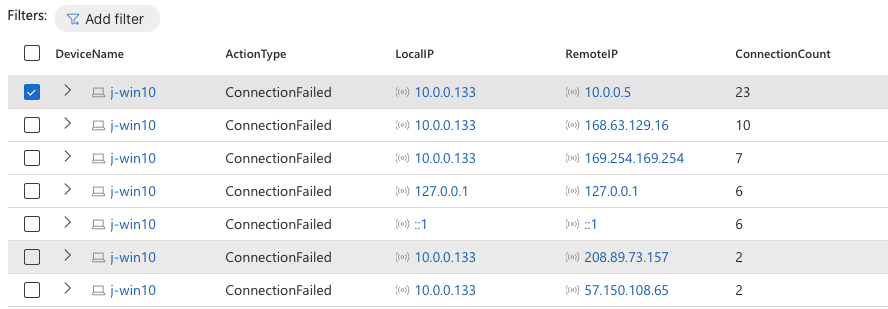
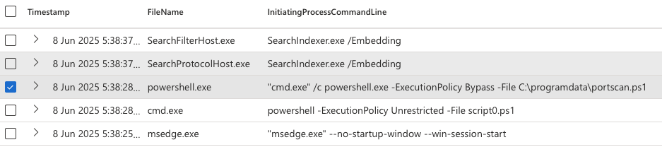
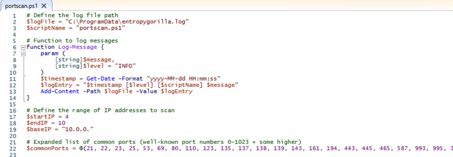
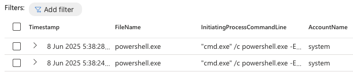
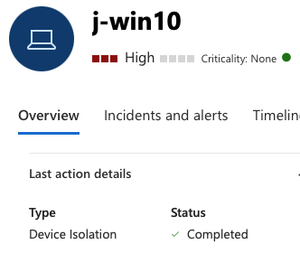
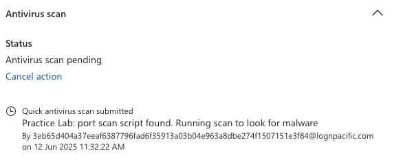

# 🛡️ Threat Hunt: Sudden Network Slowdowns – Port Scan Investigation

**Author**: Jason Nguyen  
**Date**: 👻 Friday 13th, June 2025 👻
**Tools & Technologies Used**:
- Microsoft Defender for Endpoint (MDE)
- Microsoft Sentinel
- Azure Log Analytics
- KQL (Kusto Query Language)
- PowerShell
- GitHub (Markdown, Repo Management)

## 📅 Scenario Summary: 
While investigating reports of **sudden internal network slowdowns**, I observed anomalous behavior from a Windows 10 VM (`j-win10`) including **several failed connection attempts** to internal hosts. Using Microsoft Defender for Endpoint (MDE) and KQL queries, I was able to trace the issue to an unexpected **PowerShell-based port scan** initiated by the SYSTEM account.

---

## 🧭 Timeline of Investigation

### 1️⃣ Initial Indicator: Failed Network Connections
```kql
DeviceNetworkEvents
| where DeviceName == "j-win10"
| where ActionType == "ConnectionFailed"
| summarize ConnectionCount = count() by DeviceName, ActionType, LocalIP, RemoteIP
| order by ConnectionCount
```
📝 **Observation**: High volume of failed connections from `10.0.0.133`, targeting itself and another internal host.



---

### 2️⃣ Behavioral Analysis: Sequential Port Scanning
```kql
let IPInQuestion = "10.0.0.133";
DeviceNetworkEvents
| where ActionType == "ConnectionFailed"
| where LocalIP == IPInQuestion
| order by Timestamp desc
```
📝 **Finding**: Sequential port attempts suggest a **port scanning** operation.

---

### 3️⃣ Process Correlation: Identifying the Source
```kql
let VMName = "j-win10";
let specificTime = datetime(2025-06-08T08:39:07.1275438Z);
DeviceProcessEvents
| where Timestamp between ((specificTime - 10m) .. (specificTime + 10m))
| where DeviceName == VMName
| order by Timestamp desc
| project Timestamp, FileName, InitiatingProcessCommandLine
```
📝 **Finding**: A script named `portscan.ps1` was executed via `powershell.exe`.



---

### 4️⃣ Manual Inspection: Confirming Malicious Script
Logged into the host and confirmed presence of the following script:



---

### 5️⃣ Privilege Concern: SYSTEM-Level Execution
```kql
DeviceProcessEvents
| where Timestamp between ((specificTime - 10m) .. (specificTime + 10m))
| where DeviceName == VMName
| where InitiatingProcessCommandLine contains "portscan"
| order by Timestamp desc
| project Timestamp, FileName, InitiatingProcessCommandLine, AccountName
```
📝 **Red Flag**: The script was run by the `SYSTEM` account—**not expected** and not admin-configured.





---

### 6️⃣ Remediation Actions
- ✅ **Isolated** the device in Microsoft Defender.
- ✅ **Ran antivirus/malware scan** – no detections.
- ✅ **Escalated for rebuild** due to privilege misuse and uncertainty around persistence.

---

## 🧠 MITRE ATT&CK Mapping

| Technique                              | ID             | Description                                              |
|----------------------------------------|----------------|----------------------------------------------------------|
| PowerShell                             | [T1059.001](https://attack.mitre.org/techniques/T1059/001/) | Port scan script executed via PowerShell                |
| Service Execution                      | [T1569.002](https://attack.mitre.org/techniques/T1569/002/) | SYSTEM account used to run the script                   |
| Network Service Discovery              | [T1046](https://attack.mitre.org/techniques/T1046/)         | Targeted internal services using port scan              |
| Remote System Discovery                | [T1018](https://attack.mitre.org/techniques/T1018/)         | Attempted to identify other hosts                       |
| System Network Configuration Discovery | [T1016](https://attack.mitre.org/techniques/T1016/)         | Likely goal of scanning activity                        |
| Abuse Elevation Control Mechanism      | [T1548.002](https://attack.mitre.org/techniques/T1548/002/) | SYSTEM-level execution suspicious (potential UAC bypass) |

---

## ✅ Skills Demonstrated
- KQL threat hunting across Defender tables (`DeviceNetworkEvents`, `DeviceProcessEvents`)
- Identifying and tracing suspicious behavior across logs
- Manual validation via script inspection
- Device isolation and escalation procedures
- MITRE ATT&CK mapping and incident documentation

---

## 📁 Notes

- This threat hunting activity was performed in the **Microsoft Defender for Endpoint** using **KQL queries** on the `j-win10` Microsoft Azure VM.
- Screenshots and KQL outputs have been archived locally.
- This report is part of my cybersecurity learning portfolio from Josh Madakor's Cyber Range.

---

🔗 _[Return to Threat Hunting Portfolio Index](../README.md)_

