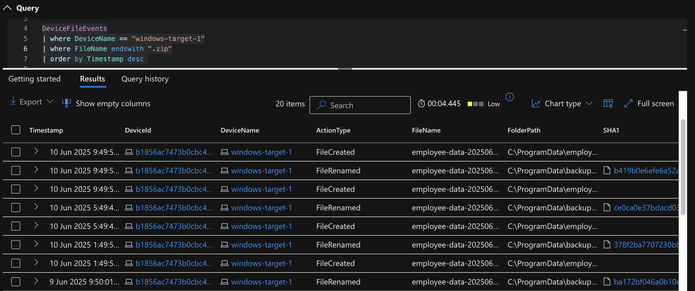
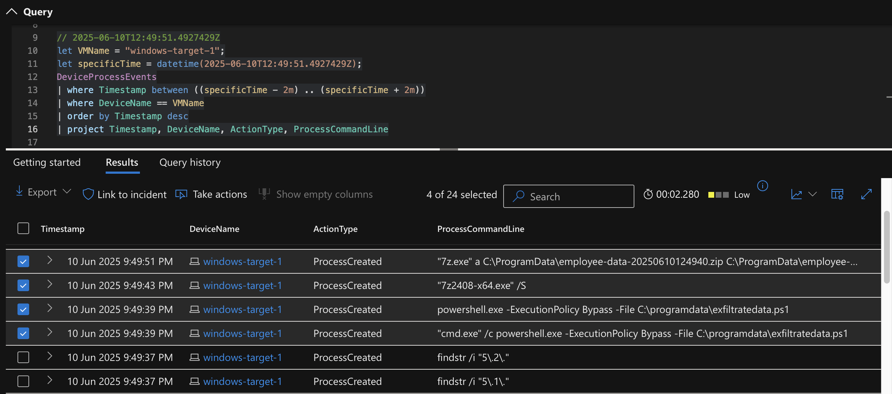
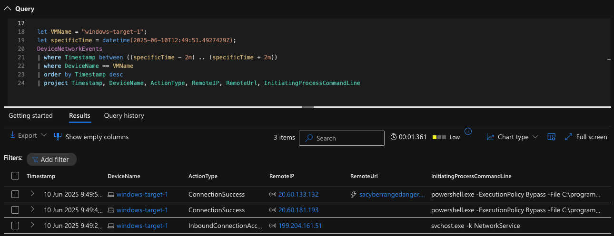

# Threat Hunting: Suspicious Use of 7-Zip and Possible Data Exfiltration

**Author**: Jason Nguyen  
**Date**: 16 June 2025

**Tools & Technologies Used**:
- Microsoft Azure
- Microsoft Defender for Endpoint (MDE)
- Microsoft Sentinel
- Azure Log Analytics
- KQL (Kusto Query Language)
- PowerShell
- GitHub (Markdown, Repo Management)

## 🕵️ Summary

During routine threat hunting activity using Microsoft Defender for Endpoint (MDE), I detected suspicious file archiving behavior followed by possible data exfiltration. PowerShell was used to silently install 7-Zip, which was then used to compress employee data. Shortly afterward, the archive appeared to be staged in a “back up” folder and a network connection to an external URL was observed. This may indicate unauthorized data exfiltration.

---

## 🗂️ Investigation Steps

### 🔍 Step 1: Searching for ZIP File Creation Events

I first searched for `.zip` file activity using the `DeviceFileEvents` table:

```kql
DeviceFileEvents
| where DeviceName == "windows-target-1"
| where FileName endswith ".zip"
| order by Timestamp desc
````



This showed multiple zip files being created and moved to a suspiciously named folder (“back up”).

---

### 🔍 Step 2: Investigating Process Activity Around ZIP File Creation

I took the timestamp from one of the `.zip` events and examined the `DeviceProcessEvents` within a 2-minute window before and after:

```kql
let VMName = "windows-target-1";
let specificTime = datetime(2025-06-10T12:49:51.4927429Z);
DeviceProcessEvents
| where Timestamp between ((specificTime - 2m) .. (specificTime + 2m))
| where DeviceName == VMName
| order by Timestamp desc
| project Timestamp, DeviceName, ActionType, ProcessCommandLine
```


This revealed that PowerShell silently installed 7-Zip and subsequently used it to archive sensitive employee data.

---

### 🔍 Step 3: Investigating Potential Data Exfiltration

I then reviewed outbound network traffic within the same timeframe:

```kql
let VMName = "windows-target-1";
let specificTime = datetime(2025-06-10T12:49:51.4927429Z);
DeviceNetworkEvents
| where Timestamp between ((specificTime - 2m) .. (specificTime + 2m))
| where DeviceName == VMName
| order by Timestamp desc
| project Timestamp, DeviceName, ActionType, RemoteIP, RemoteUrl, InitiatingProcessCommandLine
```


A successful connection to an external URL was found, suggesting the archived file may have been exfiltrated from the environment. The script used to build this lab confirmed that exfiltration was part of the intended behavior.

---

## 🛡️ Response Actions

* 🔒 Isolated the endpoint.
* 🔔 Created a detection rule for repeated `.zip` file creation within a 10-minute window.
* 📣 Notified the employee’s manager of:

  * PowerShell usage to automate 7-Zip installation and archiving.
  * Regular zip file creation and movement to a "back up" folder.
  * Evidence of external communication via network logs.

Awaiting further instructions from management.

---

## 🧭 MITRE ATT\&CK Mapping

| **Tactic**      | **Technique ID** | **Technique Name**                                            | **Context**                                                              |
| --------------- | ---------------- | ------------------------------------------------------------- | ------------------------------------------------------------------------ |
| Execution       | T1059.001        | Command and Scripting Interpreter: PowerShell                 | PowerShell used to run scripts silently installing 7-Zip.                |
| Defense Evasion | T1218.011        | Signed Binary Proxy Execution: PowerShell                     | PowerShell may have used signed binaries to avoid detection.             |
| Persistence     | T1053            | Scheduled Task/Job                                            | Archiving occurred at regular intervals, possibly via scheduled task.    |
| Collection      | T1560.001        | Archive Collected Data: Archive via Utility                   | 7-Zip used to compress sensitive employee data.                          |
| Collection      | T1074.001        | Local Data Staging                                            | Compressed archives staged in a “back up” folder prior to exfiltration.  |
| Exfiltration    | T1048.003        | Exfiltration Over Alternative Protocol (e.g. over HTTPS port) | Exfiltration may have occurred over port 443 (based on logs and script). |

---

## 📎 Notes

* If not for reviewing the lab environment’s script, I may have missed the significance of the `RemoteUrl` field — this helped confirm data was sent externally.
* This investigation emphasized the importance of correlating **file events**, **process activity**, and **network logs** with a clear timeline.
* Screenshots and KQL outputs have been archived locally.
* This report is part of my cybersecurity learning portfolio from Josh Madakor's Cyber Range.
